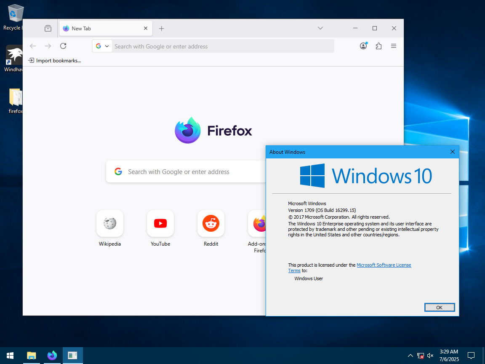

# Firefox-OldWin10-Fix
A wrapper DLL that allows the latest Firefox Nightly editions (as of 2025/08/13) to run on
Windows 10 1709 and before.

## Installation
1. Download the latest `api-ms-win-core-console-l1-2-0.dll` file from the
   [Releases](https://github.com/aubymori/Firefox-OldWin10-Fix/releases) page.
2. Place it in your Firefox install directory.